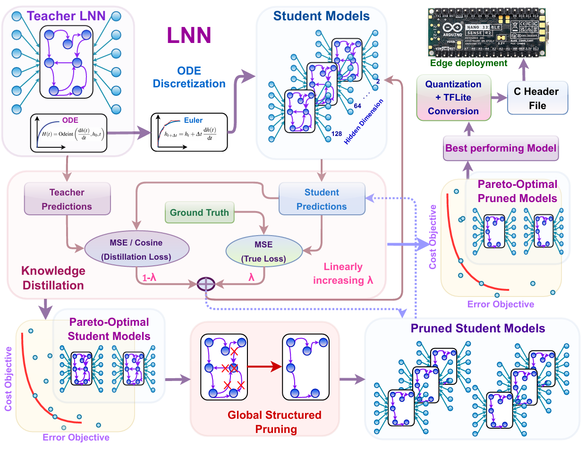

**When Smaller Wins: Dual-Stage Distillation and Pareto-Guided Compression of Liquid Neural Networks for Edge Battery Prognostics**

This repo is the official implementation of the paper "When Smaller Wins: Dual-Stage Distillation and Pareto-Guided Compression of Liquid Neural Networks for Edge Battery Prognostics", International Conference on Pattern Recognition, ICPR 2026. DOI: 10.48550/ARXIV.2601.06227

Contributors: Dhivya Dharshini Kannan; Wei Li; Wei Zhang; Jianbiao Wang; Zhi Wei Seh; Man-Fai Ng

**Abstract.** Battery management systems increasingly require accurate battery health prognostics under strict on-device constraints. This paper presents DLNet, a practical framework with dual-stage distillation of liquid neural networks that turns a high-capacity model into compact and edge-deployable models for battery health prediction. DLNet first applies Euler discretization to reformulate liquid dynamics for embedded compatibility. It then performs dual-stage knowledge distillation to transfer the teacher model’s temporal behavior and recover it after further compression. Pareto-guided selection under joint error–cost objectives retains student models that balance accuracy and efficiency. We evaluate DLNet on a widely used dataset and validate real-device feasibility on an Arduino Nano 33 BLE Sense using int8 deployment. The final deployed student achieves a low error of 0.0066 when predicting battery health over the next 100 cycles, which is 15.4% lower than the teacher model. It reduces the model size from 616 kB to 94 kB with 84.7% reduction and takes 21 ms per inference on the device. These results support a practical smaller wins observation that a small model can match or exceed a large teacher for edge-based prognostics with proper supervision and selection. Beyond batteries, the DLNet framework can extend to other industrial analytics tasks with strict hardware constraints.
Keywords: Distillation · Battery analytics · Edge intelligence.

**Code Implementation - Folder contents**
* **Data_for_Main**: Data
* **Model train and Figure**: Teacher models training
* **Model Compression All**: DLNet Compression
* **Docker Implementation**: TFLite Conversion via Docker
* **Prototype_Deployment**: Arduino deployment and Web Interface

